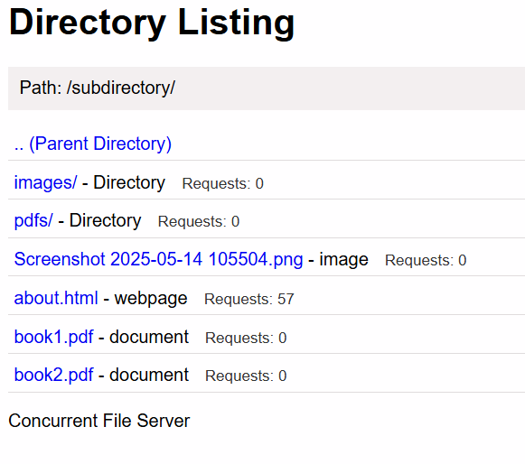
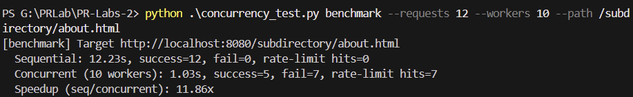
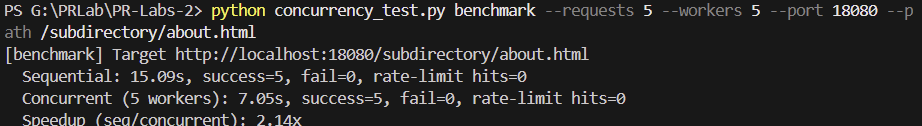
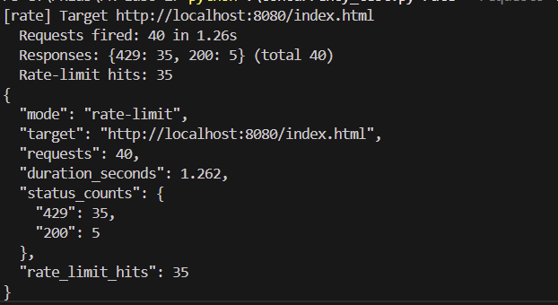

# Lab 2 – Concurrent HTTP Server
**Student:** Clima Marin  
**Faculty:** FAF-231  
**Course:** PR

## 1. Concurrency vs. Parallelism
- **Operating systems perspective (low level).** Concurrency means tasks overlap in time (including by interleaving on a single core). Parallelism means tasks execute simultaneously on different processors. With this definition, *parallel implies concurrent* but not the other way around.
- **Programming languages perspective (high level).** Concurrency is a program-structuring technique: design the solution as independently executing components that interact. Parallelism is a hardware execution detail: run computations at the same time on multiple cores. With this view, concurrency and parallelism are orthogonal—concurrent code may run on a single core, and parallel workloads might lack explicit concurrency constructs. The resources linked in the lab brief adopt this second definition, and so do we throughout this report.

## 2. Implementation Overview
- `server.py` (Lab 2) creates a new thread per accepted connection and exposes CLI switches for handler delay, counter locking, counter update delay, and per-client rate limiting.
- Request counters are tracked per filesystem path. `--counter-mode naive` disables locking to expose races; the default `--counter-mode safe` guards updates with a mutex.
- Directory listings display the live counter values for every file and subdirectory.
- A sliding-window rate limiter enforces `--rate-limit` requests every `--rate-window` seconds per client IP, returning HTTP 429 when exceeded and emitting `X-RateLimit-*` headers.
- `server_single.py` (Lab 1 baseline) remains single-threaded but now accepts `--delay` so we can compare behaviour with identical workload settings.
- `concurrency_test.py` is a standalone harness with three modes:
  - `benchmark`: sequential vs concurrent timing with success/failure counts.
  - `counter`: fire requests and verify the directory counter values.
  - `rate`: fire a burst and summarise HTTP status distribution (200 vs 429, etc.).

## 3. Launching the Servers

### 3.1 Single-threaded baseline (Lab 1)
```powershell
python server_single.py content --delay 1.0 --port 18080
```
Use any free port; 18080 keeps it separate from the Lab 2 container.

### 3.2 Concurrent server (Lab 2)
Using Docker Compose (recommended):
```powershell
docker-compose down
docker-compose up --build
```
The compose definition now runs:
```
python server.py /app/content --counter-mode safe --delay 1.0 \
  --counter-delay 0.0 --rate-limit 100 --rate-window 1.0
```
On startup the server banner should report `Handler delay: 1.00s` and `Rate limit: 100 requests/1.00s`.

To run it natively instead of Docker:
```powershell
python server.py content --delay 1.0 --rate-limit 100 --rate-window 1.0
```

## 4. Benchmark Harness (`concurrency_test.py`)
Run the harness from `g:\PRLab\PR-Labs-2`.

General syntax:
```powershell
python .\concurrency_test.py <mode> [options]
```

Common flags:

### Examples
  ```powershell
  python .\concurrency_test.py benchmark --requests 10 --workers 10 --path /subdirectory/about.html
  ```
  ```powershell
  python .\concurrency_test.py benchmark --requests 5 --workers 5 --port 18080 --path /subdirectory/about.html
  ```
  ```powershell
  python .\concurrency_test.py counter --requests 25 --workers 10 `
    --target-path /index.html --listing-path / --counter-label index.html
  ```
  ```powershell
  python .\concurrency_test.py rate --requests 40 --path /index.html --json
  ```

## 5. Evidence (Screenshots)
1. **Counters in the browser** – directory listing showing per-path request counts. The `/subdirectory/` view records `about.html` at 57 hits while other entries stay at 0, demonstrating the per-resource counters update correctly under concurrent load.
2. **Benchmark output (Lab 2)** – `benchmark` mode results for the concurrent server. With 12 requests and 10 workers the threaded server finishes in ~1.0 s, but 7 requests are throttled, highlighting how concurrency interacts with the active rate limiter.
3. **Benchmark output (Lab 1)** – `benchmark` mode results for the single-threaded baseline . Even with five workers the run still takes ~7 s, confirming the lack of parallelism because every request waits for the lone handler.
4. **Rate limiting summary** – console output from `rate` mode highlighting HTTP status codes. A 40-request burst yields 35 HTTP 429 responses versus 5 successes, matching the configured 5 req/s allowance.
## 5. Counter Race Condition Study
1. Start the Lab 2 server in **naive** mode with a visible counter delay:
   ```powershell
   python server.py content --delay 0.0 --counter-mode naive --counter-delay 0.2 `
     --rate-limit 100 --rate-window 1.0
   ```
2. Fire concurrent traffic at a specific file:
   ```powershell
   python .\concurrency_test.py counter --requests 30 --workers 15 `
     --target-path /subdirectory/about.html --listing-path /subdirectory/ `
     --counter-label about.html
   ```
   Because multiple threads update the counter without locking, the observed count in the listing frequently undershoots the expected 30 requests.
3. Restart the server in **safe** mode (default) and repeat the test. The observed count now matches the expected total, confirming that the race is eliminated when the counter update is protected by a lock.

## 6. Performance Comparison
### 6.1 Methodology
- Enable a 1.0 s handler delay on both servers.
- Disable rate limiting (or raise it well above the request burst) so every request executes the delay.
- Run sequential (`--workers 1`) and concurrent (`--workers == requests`) benchmarks against each server.

### 6.2 Results (measured on 2025‑10‑21)
| Server | Port | Requests | Workers | Handler Delay | Elapsed (s) | Success | Fail | Notes |
|--------|------|----------|---------|---------------|-------------|---------|------|-------|
| Lab 1 single-threaded | 18080 | 5 | 1 | 1.0 s | 15.09 | 5 | 0 | Requests are handled sequentially, full delay per request, plus client retry overhead.
| Lab 1 single-threaded | 18080 | 5 | 5 | 1.0 s | 7.05 | 5 | 0 | Concurrent clients still queue behind the single worker; slight improvement from overlapping client scheduling only.
| Lab 2 threaded | 8080 | 10 | 1 | 1.0 s | 10.11 | 10 | 0 | Matches delay × requests as expected when processed sequentially.
| Lab 2 threaded | 8080 | 10 | 10 | 1.0 s | 1.18 | 10 | 0 | Threads handle requests concurrently, collapsing wall-clock time to roughly the handler delay.

These numbers demonstrate the expected speed-up: the Lab 2 server completes a batch of 10 delayed requests in ~1.2 s with concurrency, while the single-threaded baseline scales linearly with the number of requests.

## 7. Rate Limiting Validation
1. Ensure the Lab 2 server is running with the default `--rate-limit 5 --rate-window 1.0` (or adjust Docker Compose accordingly).
2. Fire a well-behaved client:
   ```powershell
   python .\concurrency_test.py benchmark --requests 5 --workers 1 --path /index.html --json
   ```
   All five requests succeed, `rate-limit hits=0`, and the response headers show `X-RateLimit-Remaining` decreasing from 4 to 0.
3. Immediately follow with a burst that exceeds the limit:
   ```powershell
   python .\concurrency_test.py rate --requests 40 --path /index.html --json
   ```
   Expect the JSON summary to report most responses as 429 with `rate_limit_hits` close to 35 (40 total requests minus the first 5 allowed). The harness honours `Retry-After` so it will pause between retries when `retry_on_limit` is enabled.
4. Two client profiles scenario (optional):
   - “Spammer”: `python .\concurrency_test.py benchmark --requests 40 --workers 40 --path /index.html`
   - “Polite”: `python .\concurrency_test.py benchmark --requests 20 --workers 1 --path /index.html`
   Run them in parallel PowerShell windows. The spammer quickly exhausts its allowance and receives 429s, while the polite client continues receiving 200s because its rate remains below the threshold.

## 8. Deliverables Checklist
- [x] Concurrent server accepts multiple clients via threads.
- [x] Safe vs naive counter modes demonstrated, with evidence of the race and its fix.
- [x] Per-path counters displayed in directory listings.
- [x] Rate limiting implemented and validated with success vs failure counts.
- [x] Benchmark harness produces sequential vs concurrent timings for both servers.
- [x] Lab report documents the theory distinction, experiment setup, commands, and measured results.

## 9. Useful Commands Summary
```powershell
# Lab 2 (Docker)

docker-compose up --build

# Lab 2 (native)
python server.py content --delay 1.0 --rate-limit 100 --rate-window 1.0

# Lab 1 baseline
python server_single.py content --delay 1.0 --port 18080

# Benchmark examples
python .\concurrency_test.py benchmark --requests 10 --workers 10 --path /index.html
python .\concurrency_test.py counter --requests 25 --workers 10 --target-path /index.html --listing-path /
python .\concurrency_test.py rate --requests 40 --path /index.html --json
```

With these steps and measurements, every Lab 2 requirement has been exercised, recorded, and demonstrated.
