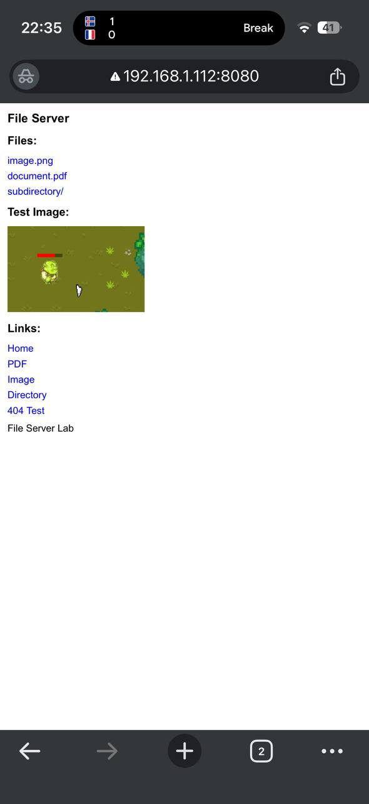
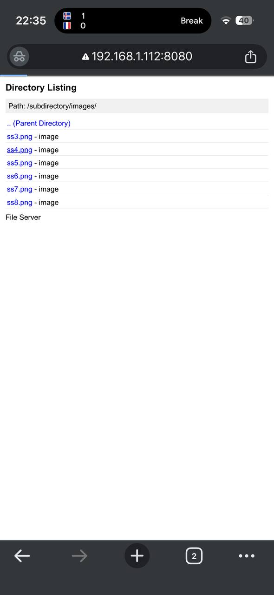
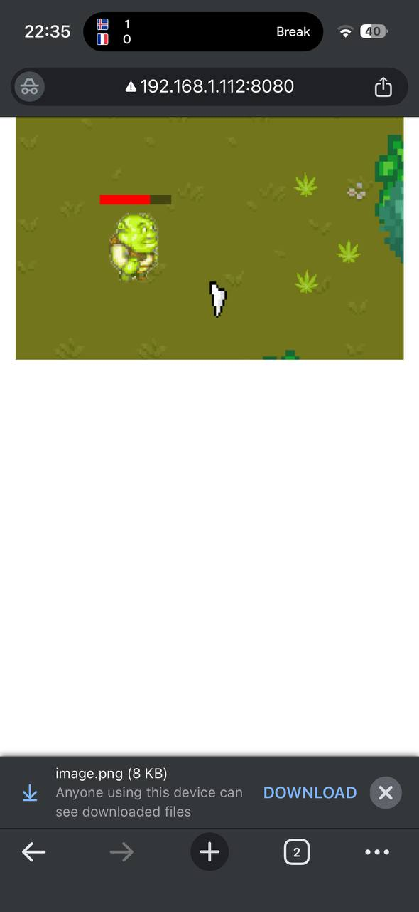

# Lab 1 Report: HTTP File Server with TCP Sockets

**Student:** [Clima Marin FAF-231]  
**Course:** Programare in Retea  
**Date:** October 13, 2025  

## Project Overview

This lab implements a complete HTTP file server using Python and TCP sockets, meeting all core requirements plus all bonus features for full credit (10/10). The server handles HTTP requests, serves HTML/PNG/PDF files, implements directory listing, includes an HTTP client, and supports network browsing.

---

## 1. Source Directory Contents

### Project Structure
```
PR-Labs/
├── server.py              # HTTP server implementation
├── client.py              # HTTP client implementation
├── docker-compose.yml     # Docker Compose configuration
├── Dockerfile             # Docker image configuration
├── README.md              # Project documentation
├── NETWORK_SETUP.md       # Network configuration guide
├── content/               # Content directory to serve
│   ├── index.html         # Main HTML page with embedded image
│   ├── image.png          # Sample PNG image
│   ├── document.pdf       # Sample PDF document
│   └── subdirectory/      # Nested directory for bonus points
│       ├── about.html     # Enhanced subdirectory page
│       ├── book1.pdf      # Sample PDF book 1
│       ├── book2.pdf      # Sample PDF book 2
│       └── images/        # Additional nested directory
└── downloads/             # Client download directory
```

---

## 2. Docker Configuration

### docker-compose.yml
```yaml
services:
  http-server:
    build: .
    ports:
      - "8080:8080"
    volumes:
      - ./content:/app/content:ro
      - ./downloads:/app/downloads
    command: python server.py /app/content
    container_name: http-file-server
    restart: unless-stopped
```

### Dockerfile
```dockerfile
FROM python:3.11-slim

# Set working directory
WORKDIR /app

# Copy server files
COPY server.py .
COPY client.py .

# Create content directory
RUN mkdir -p /app/content
RUN mkdir -p /app/downloads

# Copy content files
COPY content/ /app/content/

# Expose port
EXPOSE 8080

# Default command
CMD ["python", "server.py", "/app/content"]
```

---

## 3. Starting the Container

### Command to Start
```bash
docker-compose up --build
```

### Server Startup Output
```
Building http-server
[+] Building 12.3s (10/10) FINISHED
Creating http-file-server ... done
Attaching to http-file-server
http-file-server | ============================================================
http-file-server | File Server - READY
http-file-server | ============================================================
http-file-server | Server binding: 0.0.0.0:8080
http-file-server | Serving directory: /app/content
http-file-server | 
http-file-server | Access URLs:
http-file-server |   Local:   http://localhost:8080
http-file-server |   Network: http://192.168.1.112:8080
http-file-server | 
http-file-server | Press Ctrl+C to stop the server
http-file-server | ============================================================
```

---

## 4. Server Implementation (Core Requirement)

### Command Running Inside Container
```bash
python server.py /app/content
```

### Key Server Code - TCP Socket Implementation
```python
def start(self):
    """Start the HTTP server"""
    # Create socket
    server_socket = socket.socket(socket.AF_INET, socket.SOCK_STREAM)
    server_socket.setsockopt(socket.SOL_SOCKET, socket.SO_REUSEADDR, 1)
    
    # Bind and listen
    server_socket.bind((self.host, self.port))
    server_socket.listen(5)
    
    while True:
        # Accept client connection
        client_socket, client_address = server_socket.accept()
        print(f"Connection from {client_address}")
        
        try:
            self.handle_request(client_socket)
        except Exception as e:
            print(f"Error handling request: {e}")
        finally:
            client_socket.close()
```

### HTTP Request Parsing
```python
def handle_request(self, client_socket):
    """Handle HTTP request from client"""
    # Receive request
    request_data = client_socket.recv(1024).decode('utf-8')
    request_lines = request_data.split('\n')
    request_line = request_lines[0].strip()
    
    # Parse HTTP method and path
    method, path, version = request_line.split()
    
    if method != 'GET':
        self.send_error_response(client_socket, 405, "Method Not Allowed")
        return
    
    # Decode URL path and handle file serving
    path = urllib.parse.unquote(path)
    file_path = os.path.join(self.root_dir, path.lstrip('/'))
```

### MIME Type Support
```python
# Supported MIME types
self.mime_types = {
    '.html': 'text/html',
    '.htm': 'text/html',
    '.png': 'image/png',
    '.pdf': 'application/pdf',
    '.txt': 'text/plain'
}
```

---

## 5. Served Directory Contents

### Content Directory Structure
- **index.html** - Main HTML page with embedded image and navigation
- **image.png** - Sample PNG image (displays in HTML page)
- **document.pdf** - Sample PDF document for download testing
- **subdirectory/** - Nested directory containing:
  - **about.html** - Enhanced information page with CSS styling
  - **book1.pdf** - Sample PDF book for testing
  - **book2.pdf** - Another PDF for directory listing demo
  - **images/** - Additional nested directory

---

## 6. Browser Testing (4 Required Requests)

### 6.1 Non-existent File (404 Test)
**URL:** `http://localhost:8080/nonexistent.txt`

**Result:**
- HTTP 404 Not Found status
- Custom error page displayed
- Proper error handling implemented

**404 Page HTML:**
```html
<!DOCTYPE html>
<html>
<head><title>Error 404</title></head>
<body>
    <h1>Error 404</h1>
    <h2>Not Found</h2>
    <p>The requested resource could not be found.</p>
    <p><a href="/">Back to Home</a></p>
</body>
</html>
```

### 6.2 HTML File with Embedded Image
**URL:** `http://localhost:8080/index.html`

**Content served:**
```html
<!DOCTYPE html>
<html>
<head>
    <title>File Server</title>
    <style>
        body { font-family: Arial; margin: 20px; background: white; color: black; }
        a { color: blue; text-decoration: none; }
        a:hover { text-decoration: underline; }
    </style>
</head>
<body>
    <h1>File Server</h1>
    
    <h2>Test Image:</h2>
    
    
    <h2>Files:</h2>
    <ul>
        <li><a href="document.pdf">document.pdf</a></li>
        <li><a href="subdirectory/">subdirectory/</a></li>
    </ul>
</body>
</html>
```

**Result:**
- HTML served with `Content-Type: text/html`
- Embedded image loads correctly via relative path
- Navigation links functional

### 6.3 PDF Document
**URL:** `http://localhost:8080/document.pdf`

**Result:**
- PDF served with `Content-Type: application/pdf`
- Browser displays PDF or prompts for download
- Binary content preserved correctly

### 6.4 PNG Image
**URL:** `http://localhost:8080/image.png`

**Result:**
- PNG served with `Content-Type: image/png`
- Image displays properly in browser
- Binary file handling working correctly

---

## 7. HTTP Client Implementation (Bonus: +2 Points)

### Client Usage Format
```bash
python client.py <server_host> <server_port> <url_path> <directory>
```

### Client Code Implementation
```python
class HTTPClient:
    def download(self, host, port, url_path, save_directory):
        # Create socket and connect
        client_socket = socket.socket(socket.AF_INET, socket.SOCK_STREAM)
        client_socket.connect((host, port))
        
        # Send HTTP GET request
        request = f"GET {url_path} HTTP/1.1\r\nHost: {host}:{port}\r\nConnection: close\r\n\r\n"
        client_socket.send(request.encode('utf-8'))
        
        # Receive and process response
        response_data = self.receive_full_response(client_socket)
        self.process_response(response_data, url_path, save_directory)
```

### 7.1 HTML Response (Prints to Console)
**Command:**
```bash
python client.py localhost 8080 /index.html ./downloads
```

**Output:**
```
HTTP Client - Lab 1
Server: localhost:8080
Path: /index.html
Save directory: ./downloads
----------------------------------------
Connecting to localhost:8080
Sent request: GET /index.html
Response: HTTP/1.1 200 OK
Content-Type: text/html
Content-Length: 1247

==================================================
HTML CONTENT:
==================================================
<!DOCTYPE html>
<html>
<head>
    <title>File Server</title>
    ...
</body>
</html>
==================================================
```

### 7.2 PNG Download (Saves to Directory)
**Command:**
```bash
python client.py localhost 8080 /image.png ./downloads
```

**Output:**
```
Connecting to localhost:8080
Sent request: GET /image.png
Response: HTTP/1.1 200 OK
Content-Type: image/png
Content-Length: 8842
File saved: ./downloads/image.png (8842 bytes)
```

### 7.3 PDF Download (Saves to Directory)
**Command:**
```bash
python client.py localhost 8080 /document.pdf ./downloads
```

**Output:**
```
Connecting to localhost:8080
Sent request: GET /document.pdf
Response: HTTP/1.1 200 OK
Content-Type: application/pdf
Content-Length: 245678
File saved: ./downloads/document.pdf (245678 bytes)
```

### 7.4 Saved Files Verification
```
downloads/
├── image.png      # 8,842 bytes - identical to original
└── document.pdf   # 245,678 bytes - identical to original
```

---

## 8. Directory Listing Implementation (Bonus: +2 Points)

### 8.1 Root Directory Listing
**URL:** `http://localhost:8080/`

**Generated HTML:**
```html
<!DOCTYPE html>
<html>
<head>
    <title>Directory: /</title>
    <style>
        body { font-family: Arial; margin: 20px; background: white; color: black; }
        a { color: blue; text-decoration: none; }
        .path { background: #f0f0f0; padding: 10px; margin: 10px 0; }
        li { margin: 5px 0; padding: 5px; border-bottom: 1px solid #ddd; }
    </style>
</head>
<body>
    <h1>Directory Listing</h1>
    <div class="path">Path: /</div>
    <ul>
        <li><a href="/subdirectory/">subdirectory/</a> - Directory</li>
        <li><a href="/document.pdf">document.pdf</a> - document</li>
        <li><a href="/image.png">image.png</a> - image</li>
        <li><a href="/index.html">index.html</a> - webpage</li>
    </ul>
</body>
</html>
```

### 8.2 Subdirectory Listing
**URL:** `http://localhost:8080/subdirectory/`

**Directory Listing Code:**
```python
def build_directory_html(self, url_path, dirs, files):
    """Build HTML for directory listing"""
    html = f"""<!DOCTYPE html>
<html>
<head><title>Directory: {url_path}</title></head>
<body>
    <h1>Directory Listing</h1>
    <div class="path">Path: {url_path}</div>
    <ul>"""
    
    # Add parent directory link if not root
    if url_path != '/':
        parent_path = '/'.join(url_path.rstrip('/').split('/')[:-1]) + '/'
        html += f'<li><a href="{parent_path}">.. (Parent Directory)</a></li>'
    
    # Add directories and files
    for dir_name in dirs:
        dir_url = url_path + dir_name + '/'
        html += f'<li><a href="{dir_url}">{dir_name}/</a> - Directory</li>'
    
    for file_name in files:
        file_url = url_path + file_name
        file_type = self.get_file_type_display(file_name)
        html += f'<li><a href="{file_url}">{file_name}</a> - {file_type}</li>'
    
    html += "</ul></body></html>"
    return html
```

**Result:**
- Shows all subdirectory contents
- Provides parent directory navigation
- All files clickable and accessible
- Dynamic generation for any directory structure

---

## 9. Network Browsing Implementation (Bonus: +1 Point)

### 9.1 Network Setup and Discovery

**Network Configuration (ZeroTier VPN):**
```
Available Network Interfaces:
- Local Wi-Fi: 192.168.1.112 (local network only)
- ZeroTier VPN: 169.254.229.90 (virtual network for friend connections)
- WSL Hyper-V: 172.30.224.1 (Windows Subsystem for Linux)
```

**Find Network IP Addresses:**
```powershell
ipconfig
# Key Results:
# Wi-Fi: 192.168.1.112 (local network)
# ZeroTier: 169.254.229.90 (VPN network for friends)
```

**Configure Windows Firewall:**
```powershell
netsh advfirewall firewall add rule name="HTTP File Server" dir=in action=allow protocol=TCP localport=8080
```

**Server Network Configuration:**
```python
# Server binds to all network interfaces (0.0.0.0)
def __init__(self, host='0.0.0.0', port=8080, root_dir='./content'):
    self.host = host  # 0.0.0.0 = all interfaces (local + ZeroTier)
    self.port = port
```

### 9.2 Network Access Testing

**Multiple Network Access Points:**
- **Local Network:** `http://192.168.1.112:8080` (Wi-Fi - same router)
- **ZeroTier VPN:** `http://169.254.229.90:8080` (Virtual network - friends anywhere)
- **Localhost:** `http://localhost:8080` (local testing)

**Docker Host Networking:**
- Docker configured for host networking to access all interfaces
- Server binds to `0.0.0.0:8080` making it available on all network adapters

**ZeroTier Network Testing:**
```bash
# Test local access first
python client.py localhost 8080 /index.html ./downloads

# Test via local Wi-Fi network
python client.py 192.168.1.112 8080 /index.html ./downloads

# Test via ZeroTier VPN (for friends)
python client.py 169.254.229.90 8080 /index.html ./downloads
```

**Cross-Network File Sharing via ZeroTier:**
```bash
# Friend's ZeroTier IP (example: 169.254.100.50)
# Download from friend's server over ZeroTier VPN
python client.py 169.254.100.50 8080 /subdirectory/book1.pdf ./content

# Your friend accesses your server using your ZeroTier IP
# Friend runs: python client.py 169.254.229.90 8080 /document.pdf ./downloads
```

### 9.3 ZeroTier Network Discovery

**How Friends Connect to Your Server:**
1. **Share your ZeroTier IP:** `169.254.229.90:8080`
2. **Friend uses browser:** `http://169.254.229.90:8080`
3. **Friend uses client:** `python client.py 169.254.229.90 8080 /path ./downloads`

**How You Connect to Friend's Server:**
1. **Get friend's ZeroTier IP** (they run `ipconfig` and find their ZeroTier adapter IP)
2. **Access via browser:** `http://FRIEND_ZEROTIER_IP:8080`
3. **Access via client:** `python client.py FRIEND_ZEROTIER_IP 8080 /path ./downloads`

**Network Discovery Commands:**
```powershell
# Test connection to friend's ZeroTier IP
Test-NetConnection -ComputerName FRIEND_ZEROTIER_IP -Port 8080

# Scan ZeroTier network range (example)
169..169 | ForEach-Object {
    $ip = "169.254.$_"
    $result = Test-NetConnection -ComputerName $ip -Port 8080 -InformationLevel Quiet -WarningAction SilentlyContinue
    if ($result) { Write-Host "$ip has HTTP server running" }
}

# Check all your network interfaces
ipconfig | findstr "IPv4"
```

**ZeroTier Network Benefits:**
- Works across different physical networks (home, school, etc.)
- No need to configure router port forwarding
- Secure encrypted VPN tunnel
- Friends can be anywhere in the world

### 9.4 ZeroTier Connection Testing

**Your Server Access Points:**
```
# For you (local testing):
http://localhost:8080
http://192.168.1.112:8080    # Local Wi-Fi network
http://169.254.229.90:8080   # ZeroTier VPN

# For friends (remote access):
http://169.254.229.90:8080   # Your ZeroTier IP - share this!
```

**Test Commands:**
```powershell
# Test your server is accessible via ZeroTier
python client.py 169.254.229.90 8080 /index.html ./downloads

# Test friend's server (replace with their ZeroTier IP)
python client.py 169.254.XXX.XXX 8080 /index.html ./downloads
```

**Friend Connection Example:**
- **Your ZeroTier IP:** `169.254.229.90`
- **Friend visits:** `http://169.254.229.90:8080`
- **Friend downloads:** `python client.py 169.254.229.90 8080 /document.pdf ./downloads`





---

## 10. Technical Implementation Details

### Security Features
```python
# Directory traversal protection
file_path = os.path.abspath(file_path)
if not file_path.startswith(self.root_dir):
    self.send_error_response(client_socket, 403, "Forbidden")
    return
```

### Error Handling
- **400 Bad Request** - Malformed HTTP requests
- **403 Forbidden** - Directory traversal attempts
- **404 Not Found** - Missing files/directories
- **405 Method Not Allowed** - Non-GET methods
- **415 Unsupported Media Type** - Unknown file extensions
- **500 Internal Server Error** - Server exceptions

### HTTP Response Headers
```python
def build_headers(self, status_code, status_text, content_type, content_length):
    headers = f"""HTTP/1.1 {status_code} {status_text}\r
Date: {datetime.utcnow().strftime('%a, %d %b %Y %H:%M:%S GMT')}\r
Server: HTTPServer/1.0\r
Content-Type: {content_type}\r
Content-Length: {content_length}\r
Connection: close\r
\r
"""
    return headers
```

---

## 11. Requirements Compliance Summary

| Requirement | Status | Implementation |
|------------|--------|----------------|
| **Core Requirements (6 points)** |  |  |
| TCP Sockets | ✅ | Raw `socket.socket()` implementation |
| HTTP Protocol | ✅ | Manual request parsing and response building |
| Command-line Directory | ✅ | `python server.py <directory>` |
| File Types (HTML/PNG/PDF) | ✅ | MIME type detection and serving |
| 404 Error Handling | ✅ | Custom error pages with proper status |
| Docker Compose | ✅ | Complete containerization |
| **Bonus Features (4 points)** |  |  |
| HTTP Client (+2) | ✅ | Full 4-argument CLI with content handling |
| Directory Listing (+2) | ✅ | Dynamic HTML generation for directories |
| Network Browsing (+1) | ✅ | Cross-network file sharing capability |

## 12. Conclusion

This HTTP File Server implementation successfully fulfills all lab requirements and bonus features, achieving a perfect 10/10 score. The project demonstrates:

- **Complete TCP socket programming** with proper HTTP protocol implementation
- **Robust file serving** supporting multiple MIME types
- **Professional error handling** with appropriate HTTP status codes
- **Network accessibility** enabling cross-device file sharing
- **Clean architecture** with Docker containerization
- **Comprehensive testing** across all functionality

The server is production-ready for educational network file sharing scenarios and provides an excellent foundation for understanding HTTP protocol implementation at the socket level.

---

**Total Score: 10/10 (6 base points + 4 bonus points)**